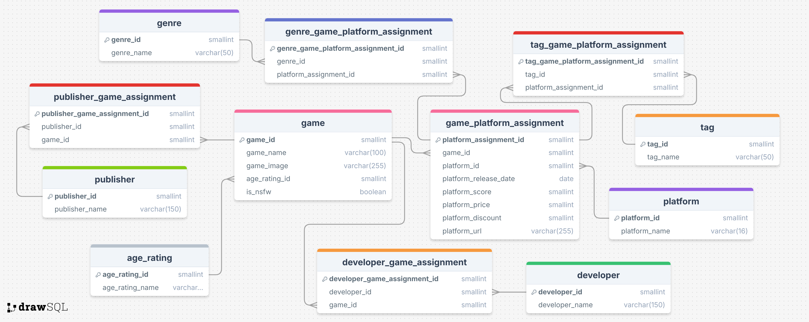

# Game Tracker Project

A project designed for monitoring the latest game releases across Steam, GOG and Epic.

## Description

This project includes an ETL pipeline for each storefront, each in their own folder. These pipelines are designed to be ran on AWS using lambdas which get triggered every 3 hours. The pipeline scrapes data from the store pages, cleans that data and inserts it into a database. That database is then read by a streamlit dashboard which is designed to be hosted online. Users will be able to then view information about the latest game releases as well as sign up to an email system that alerts them when a new game releases in a genre they have subscribed to as well as weekly summary emails.

The project *can* be run locally with some minor adjustments but is ultimately designed to be run on AWS. There are terraform files and Dockerfiles provided for this end.

## Contents

#### [Dashboard](./dashboard/README.md)

#### [Database](./database/README.md)

#### [Daily Genre Emails](./email_lambdas/genre_emails/README.md)

#### [Weekly Summary Emails](./email_lambdas/weekly_digest/README.md)

#### [Epic Pipeline](./pipeline/epic_pipeline/README.md)

#### [GOG Pipeline](./pipeline/gog_pipeline/README.md)

#### [Steam Pipeline](./pipeline/steam_pipeline/README.md)

#### [Terraform](./terraform/README.md)

## Getting Started

### Dependencies

* Python 3

See requirements.txt files in each folder for the required python libraries. The requirements.txt in the root directory contains all requirements.

Optional:
* [Terraform](https://www.terraform.io/)
* [Docker](https://www.docker.com/)
* An AWS account and knowledge of using ECRs

### Installing

- In a [venv](https://docs.python.org/3/library/venv.html) (use `python3 -m venv .venv` followed by `source .venv/bin/activate`) run `find . -name 'requirements.txt' -exec pip install -r {} \;` from the root directory of this project to install all the required libraries or just run `pip install -r requirements.txt` in the folder you want to run.

- Type `vim .env` and then add the following by going into edit mode by pressing `i`:

```
# AWS keys
AWS_ACCESS_KEY=[Your AWS access key]
AWS_SECRET_ACCESS_KEY=[Your AWS secret key]
AWS_REGION=[Your AWS region]
PRIVATE_AWS_ACCESS_KEY=[Your AWS access key]
PRIVATE_AWS_SECRET_ACCESS_KEY=[Your AWS secret key]
PRIVATE_AWS_REGION=[Your AWS region]

# Database info
DB_HOST=[Your database host url]
DB_PORT=[Your database access port]
DB_PASSWORD=[Your database password]
DB_USERNAME=[Your database username]
DB_NAME=[Your database name]

# Misc AWS requirements
SNS_TOPIC_ARN=[Your SNS topic ARN]
PRIVATE_BUCKET_NAME=[Your S3 bucket name]
```

followed by `esc` then type `wq!` to save those changes and quit out of vim.

This `.env` file contains all the information you need, you can make it and then copy it into each folder for simplicity, however the minimum required `.env` information will be explained in each folders README.

- OPTIONAL: If you wish to [terraform](https://www.terraform.io/) the required resources go into the `terraform` folder and type `vim variables.tfvars`, go into edit mode by pressing `i` and add

```
AWS_ACCESS_KEY = "[Your AWS access key]"
AWS_SECRET_ACCESS_KEY = "[Your AWS secret key]"
VPC_ID = "[Your VPC ID]"
DB_HOST = "[Your database host url]"
DB_PORT = [Your database access port]
DB_PASSWORD = "[Your database password]"
DB_USERNAME = "[Your database name]"
DB_NAME = "[Your database name]"
SNS_TOPIC_ARN = "[Your SNS topic ARN]"
```

followed by `esc` then type `wq!` to save those changes and quit out of vim.
You will now need to run `terraform plan` and `terraform apply` to create the resources.
Please note, this will not create the ECR which will need to be done through the AWS UI. You will need [docker](https://www.docker.com/) or equivalent to containerise the program and put it on the ECR, we have included the required Dockerfiles for this.

## Useful diagrams

### Architecture Diagram


### ERD



## Authors

Contributors names and contact info

* [Candice Bennett](https://github.com/Candice-Bennett)
* [Robert Howarth](https://github.com/robkenhow77-sigma-labs-trainee)
* [Abdirahman Mohamud](https://github.com/OfficialARM17)
* [Benjamin Smith](https://github.com/CodeTechBen)
