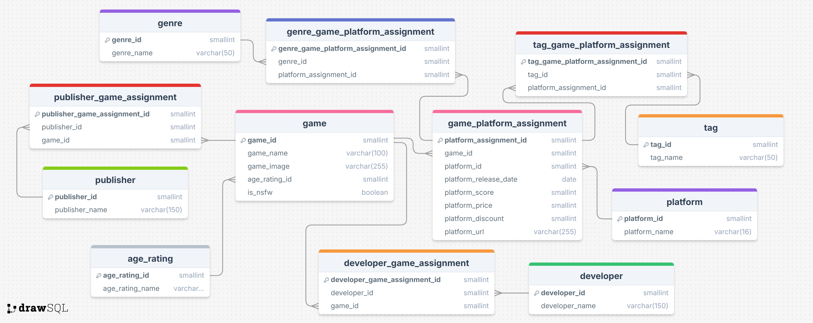

# Database

This folder contains all files related to the database that stores all the scraped data.

## How to use

We used a [postgres](https://www.postgresql.org/) database managed on an AWS RDS.

Here is the ERD:

## Files

Using the `schema.sql` file you can set up the database with the same layout that the pipelines expect.

the `.sh` files allow for a speedy connecting or resetting of the database but these will need to be adapted to your own use case.